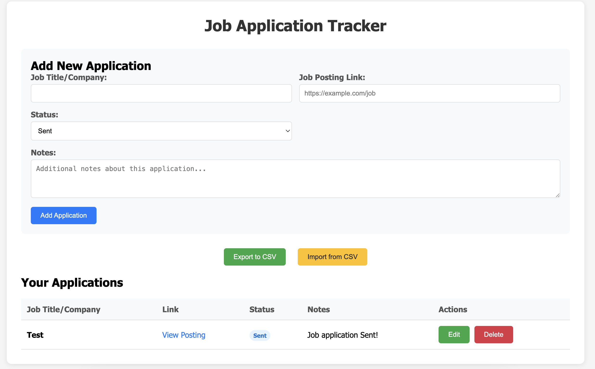

# Job Application Tracker

A simple web-based application to track your job applications with CSV import/export functionality.



## Features

- **Add Applications**: Track job title/company, posting link, status, and notes
- **Status Management**: Set status as Sent, Awaiting Results, or Rejected
- **Edit/Delete**: Modify or remove applications as needed
- **CSV Export**: Download your data as a CSV file for backup
- **CSV Import**: Upload CSV files to restore or transfer data
- **Local Storage**: Data persists in your browser between sessions

## Usage

1. Open `job-tracker.html` in your web browser
2. Add job applications using the form
3. View all applications in the table below
4. Use Export/Import buttons to backup or restore data

## CSV Format

The CSV file uses the following format:

```csv
Job Title/Company,Link,Status,Notes,Date Added
"Software Engineer","https://example.com/job","sent","Applied via LinkedIn","2024-01-15"
"Frontend Developer","","awaiting","Phone interview scheduled","2024-01-16"
```

### Status Values
- `sent` - Application sent
- `awaiting` - Awaiting results  
- `reject` - Rejected

## File Structure

```
JobApplication/
├── job-tracker.html    # Main application file
└── README.md          # This file
```

## Technical Details

- **Storage**: Uses browser localStorage for data persistence
- **Export**: Downloads CSV file with current date
- **Import**: Validates CSV format and replaces current data
- **Responsive**: Works on desktop and mobile devices

## Getting Started

Simply download `job-tracker.html` and open it in any modern web browser. No installation or server required.